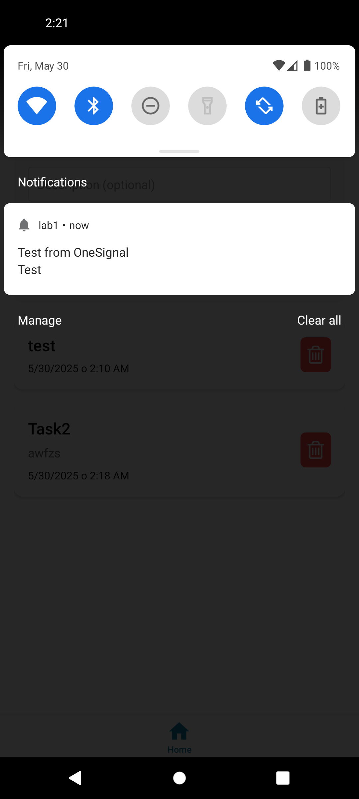

# Лаборатона робота №4

Виконав Денисюк Сергій Михайлович | Група ІПЗ-21-4

# Запуск проєкту

```sh
npm run android  # для запуску на Android пристрої або емуляторі
npm run ios      # для запуску на iOS пристрої або емуляторі
npm run web      # для запуску у браузері
```


# Скріншоти:


## Головний екран:

## Вибір дати та часу нагадування:

## Push-повідомлення з нагадуванням:

## Push-повідомлення з OneSignal Dashboard:

